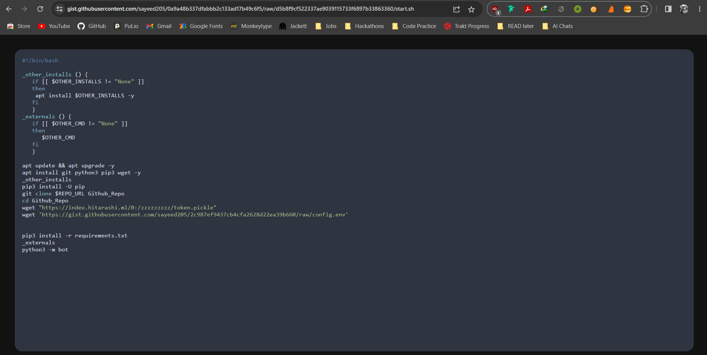
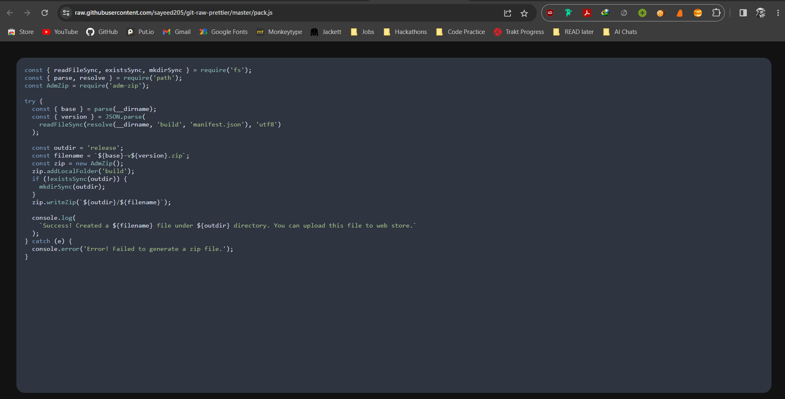

# Git Raw Prettier

Prettify your GitHub Gist and GitHub raw links with.

## Installation

1. Go to [Releases](https://github.com/sayeed205/git-raw-prettier/releases) and download the latest version of the extension.

2. Unzip the file and you should have a folder named `git-raw-prettier`.

3. In Chrome go to the extensions page [chrome://extensions](chrome://extensions).

4. Enable Developer Mode.

5. Drag the `git-raw-prettier` folder anywhere on the page to import it (do not delete the folder afterwards).

## Usage

1. Go to any GitHub Gist or GitHub raw link and see the magic.

## To Do

- [x] Add minimal UI for prettifying GitHub raw links.

- [x] Add button for copying the code.

- [ ] Add button for downloading the code.

- [ ] Add toggle for turning off prettying.

- [ ] Add dropdown for selecting theme.

- [ ] Add dropdown for font size.

- [ ] Add dropdown for font family.

- [ ] Add line numbers.

## Screenshots

GitHub Gist

GitHub Raw

## License

[MIT](./LICENSE)

## Author

[Sayed Ahmed](https://github.com/sayeed205)

## Contributing

Pull requests are welcome. For major changes, please open an issue first to discuss what you would like to change.

## Credits

- [Highlight.js](https://highlightjs.org/)
- [chrome-extension-cli](https://github.com/dutiyesh/chrome-extension-cli)
